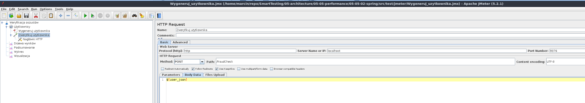
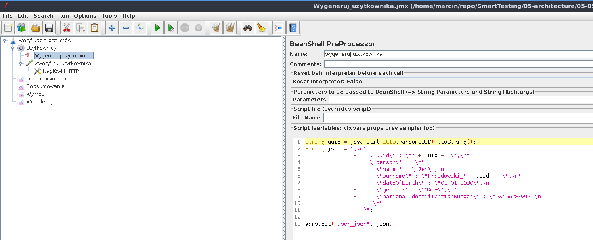
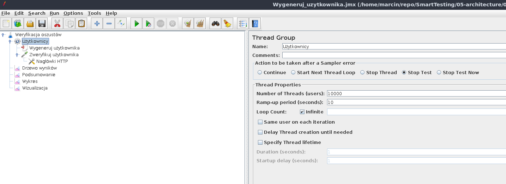
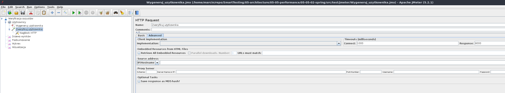
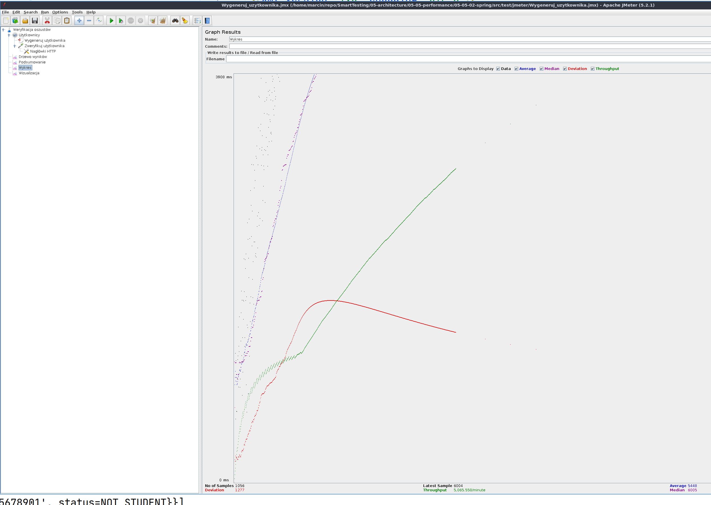
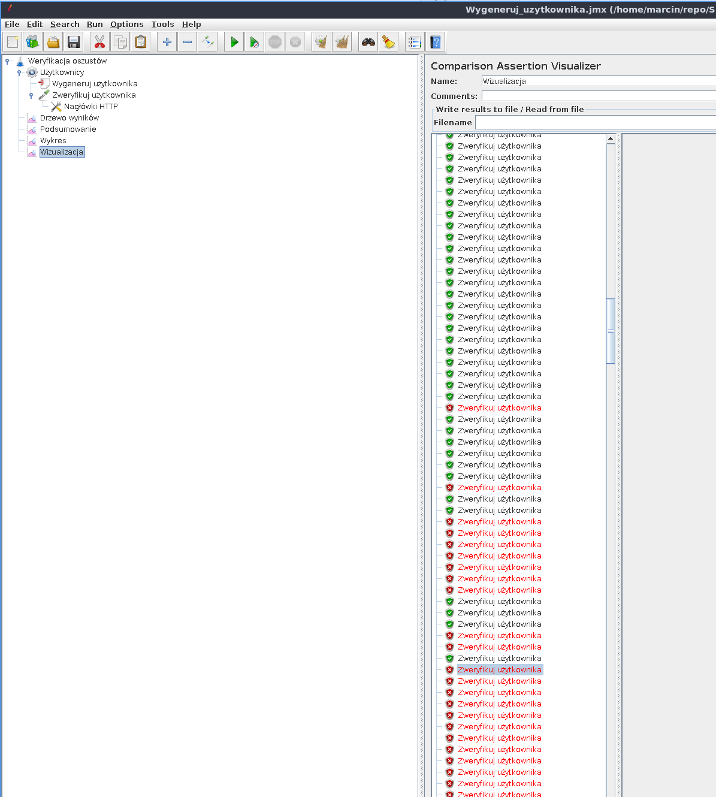
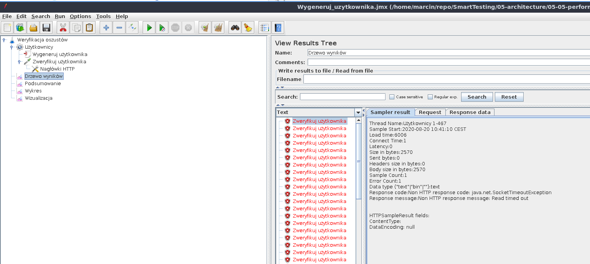
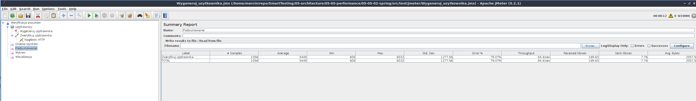

= Testy wydajności

== Uruchomienie testów wydajnościowych za pomocą Apache JMeter

Najpierw uruchamiamy infrastrukturę.

```
$ docker-compose up
```

Następnie budujemy i uruchamiamy aplikację.

```
cd ./WebApplication/
dotnet run --configuration Release
```

Instalujemy i uruchamiamy aplikację Apache JMeter - https://jmeter.apache.org/

Importujemy plik z konfiguracją wygenerowania użytkownika `JMeter/Wygeneruj_uzytkownika.jmx` poprzez kliknięcie w `File->Open`. Testy wydajnościowe ustawione są pod uruchomienie na porcie `5000`.



To co chcemy osiągnąć to wysłanie JSONa w celu wygenerowania użytkownika.



Chcemy przeprowadzić load testy, czyli zobaczyć ilu użytkowników jesteśmy w stanie obsłużyć. Oczywiście na potrzeby szkolenia nie przygotowujemy specjalnego środowiska, uruchamiamy po prostu aplikację lokalnie.



`Ramp-up period` : Czas, który JMeter potrzebuje, żeby uruchomić odpowiednią liczbę wątków. W naszej sytuacji JMeter ma 10 sekund, żeby uruchomić 10 000 wątków. Czyli co sekundę uruchomionych zostanie kolejnych 1 000 wątków.

Ustawiamy konfigurację związaną z połączeniem (max 1 000 ms, na połączenie i 6 000 ms na odpowiedź).



Uruchamiamy testy poprzez wciśnięcie zielonego przycisku play na górze.



W pewnym momencie możemy zauważyć, że wyskakują nam błędy.



Błędy dotyczą połączenia.



Możemy też pokazać podsumowanie związane z uruchomieniem naszego testu.



== Uruchomienie testów micro-benchmarkingu za pomocą BenchmarkDotNet

W projekcie Benchmarks w klasie `CustomerVerifierBenchmarks.cs` mamy zdefiniowane testy micro-benchmark. Można je odpalić z Visual Studio (oznaczając Benchmarks jako projekt startowy i uruchamiając jak każdą aplikację konsolową. Pamiętaj jednak, by ustawić konfigurację na Release - BenchmarkDotNet odmówi uruchomienia testów na niezoptymalizowanej binarce), bądź z linii poleceń, wchodząc w konsoli do folderu w którym znajduje się Benchmark.csproj i wykonując 

`dotnet run --configuration Release`

I dostaniemy mniej więcej taki wynik w konsoli.

```
// Validating benchmarks:
// ***** BenchmarkRunner: Start   *****
// ***** Found 1 benchmark(s) in total *****
// ***** Building 1 exe(s) in Parallel: Start   *****
// start dotnet restore  /p:UseSharedCompilation=false /p:BuildInParallel=false /m:1 in ...\smarttesting-netcore\05-Architecture\Src\05-05-Performance\Benchmarks\bin\Release\net6.0\4267006f-ac97-46fd-9c0d-5059cbd665cc
// command took 4.87s and exited with 0
// start dotnet build -c Release  --no-restore /p:UseSharedCompilation=false /p:BuildInParallel=false /m:1 in ...\smarttesting-netcore\05-Architecture\Src\05-05-Performance\Benchmarks\bin\Release\net6.0\4267006f-ac97-46fd-9c0d-5059cbd665cc
// command took 10.59s and exited with 0
// ***** Done, took 00:00:15 (15.71 sec)   *****
// Found 1 benchmarks:
//   CustomerVerifierBenchmarks.ShouldProcessFraud: Job-BTHZBI(Runtime=.NET Core 3.1, InvocationCount=1, IterationCount=2, IterationTime=10.0000 s, LaunchCount=1, UnrollFactor=1, WarmupCount=2)

// **************************
// Benchmark: CustomerVerifierBenchmarks.ShouldProcessFraud: Job-BTHZBI(Runtime=.NET Core 3.1, InvocationCount=1, IterationCount=2, IterationTime=10.0000 s, LaunchCount=1, UnrollFactor=1, WarmupCount=2)
// *** Execute ***
// Launch: 1 / 1
// Execute: dotnet "4267006f-ac97-46fd-9c0d-5059cbd665cc.dll" --benchmarkName "Benchmarks.CustomerVerifierBenchmarks.ShouldProcessFraud" --job "Runtime=.NET Core 3.1, InvocationCount=1, IterationCount=2, IterationTime=10.0000 s, LaunchCount=1, UnrollFactor=1, WarmupCount=2" --benchmarkId 0 in ...\smarttesting-netcore\05-Architecture\Src\05-05-Performance\Benchmarks\bin\Release\net6.0\4267006f-ac97-46fd-9c0d-5059cbd665cc\bin\Release\net6.0
// BeforeAnythingElse

// Benchmark Process Environment Information:
// Runtime=.NET Core 3.1.8 (CoreCLR 4.700.20.41105, CoreFX 4.700.20.41903), X64 RyuJIT
// GC=Concurrent Workstation
// Job: Job-ZDUHLD(InvocationCount=1, IterationCount=2, IterationTime=10.0000 s, LaunchCount=1, UnrollFactor=1, WarmupCount=2)

OverheadJitting  1: 1 op, 252800.00 ns, 252.8000 us/op
WorkloadJitting  1: 1 op, 371763600.00 ns, 371.7636 ms/op

OverheadWarmup   1: 1 op, 200.00 ns, 200.0000 ns/op
OverheadWarmup   2: 1 op, 300.00 ns, 300.0000 ns/op
OverheadWarmup   3: 1 op, 700.00 ns, 700.0000 ns/op
OverheadWarmup   4: 1 op, 200.00 ns, 200.0000 ns/op
OverheadWarmup   5: 1 op, 200.00 ns, 200.0000 ns/op
OverheadWarmup   6: 1 op, 200.00 ns, 200.0000 ns/op

OverheadActual   1: 1 op, 300.00 ns, 300.0000 ns/op
OverheadActual   2: 1 op, 300.00 ns, 300.0000 ns/op
OverheadActual   3: 1 op, 200.00 ns, 200.0000 ns/op
OverheadActual   4: 1 op, 300.00 ns, 300.0000 ns/op
OverheadActual   5: 1 op, 400.00 ns, 400.0000 ns/op
OverheadActual   6: 1 op, 200.00 ns, 200.0000 ns/op
OverheadActual   7: 1 op, 200.00 ns, 200.0000 ns/op
OverheadActual   8: 1 op, 200.00 ns, 200.0000 ns/op
OverheadActual   9: 1 op, 200.00 ns, 200.0000 ns/op
OverheadActual  10: 1 op, 200.00 ns, 200.0000 ns/op
OverheadActual  11: 1 op, 200.00 ns, 200.0000 ns/op
OverheadActual  12: 1 op, 200.00 ns, 200.0000 ns/op
OverheadActual  13: 1 op, 200.00 ns, 200.0000 ns/op
OverheadActual  14: 1 op, 200.00 ns, 200.0000 ns/op
OverheadActual  15: 1 op, 200.00 ns, 200.0000 ns/op
OverheadActual  16: 1 op, 200.00 ns, 200.0000 ns/op
OverheadActual  17: 1 op, 400.00 ns, 400.0000 ns/op
OverheadActual  18: 1 op, 200.00 ns, 200.0000 ns/op
OverheadActual  19: 1 op, 200.00 ns, 200.0000 ns/op
OverheadActual  20: 1 op, 100.00 ns, 100.0000 ns/op

WorkloadWarmup   1: 1 op, 950757800.00 ns, 950.7578 ms/op
WorkloadWarmup   2: 1 op, 245664600.00 ns, 245.6646 ms/op

// BeforeActualRun
WorkloadActual   1: 1 op, 322813900.00 ns, 322.8139 ms/op
WorkloadActual   2: 1 op, 277339400.00 ns, 277.3394 ms/op

// AfterActualRun
WorkloadResult   1: 1 op, 322813700.00 ns, 322.8137 ms/op
WorkloadResult   2: 1 op, 277339200.00 ns, 277.3392 ms/op

// AfterAll
// Benchmark Process 10040 has exited with code 0

// Run, Diagnostic
// Execute: dotnet "4267006f-ac97-46fd-9c0d-5059cbd665cc.dll" --benchmarkName "Benchmarks.CustomerVerifierBenchmarks.ShouldProcessFraud" --job "Runtime=.NET Core 3.1, InvocationCount=1, IterationCount=2, IterationTime=10.0000 s, LaunchCount=1, UnrollFactor=1, WarmupCount=2" --benchmarkId 0 in ...\smarttesting-netcore\05-Architecture\Src\05-05-Performance\Benchmarks\bin\Release\net6.0\4267006f-ac97-46fd-9c0d-5059cbd665cc\bin\Release\net6.0
// BeforeAnythingElse

// Benchmark Process Environment Information:
// Runtime=.NET Core 3.1.8 (CoreCLR 4.700.20.41105, CoreFX 4.700.20.41903), X64 RyuJIT
// GC=Concurrent Workstation
// Job: Job-ASBTOW(InvocationCount=1, IterationCount=2, IterationTime=10.0000 s, LaunchCount=1, UnrollFactor=1, WarmupCount=2)

OverheadJitting  1: 1 op, 270000.00 ns, 270.0000 us/op
WorkloadJitting  1: 1 op, 1107173700.00 ns, 1.1072 s/op

OverheadWarmup   1: 1 op, 1600.00 ns, 1.6000 us/op
OverheadWarmup   2: 1 op, 300.00 ns, 300.0000 ns/op
OverheadWarmup   3: 1 op, 200.00 ns, 200.0000 ns/op
OverheadWarmup   4: 1 op, 200.00 ns, 200.0000 ns/op
OverheadWarmup   5: 1 op, 200.00 ns, 200.0000 ns/op
OverheadWarmup   6: 1 op, 200.00 ns, 200.0000 ns/op
OverheadWarmup   7: 1 op, 200.00 ns, 200.0000 ns/op

OverheadActual   1: 1 op, 200.00 ns, 200.0000 ns/op
OverheadActual   2: 1 op, 300.00 ns, 300.0000 ns/op
OverheadActual   3: 1 op, 200.00 ns, 200.0000 ns/op
OverheadActual   4: 1 op, 200.00 ns, 200.0000 ns/op
OverheadActual   5: 1 op, 200.00 ns, 200.0000 ns/op
OverheadActual   6: 1 op, 200.00 ns, 200.0000 ns/op
OverheadActual   7: 1 op, 200.00 ns, 200.0000 ns/op
OverheadActual   8: 1 op, 300.00 ns, 300.0000 ns/op
OverheadActual   9: 1 op, 200.00 ns, 200.0000 ns/op
OverheadActual  10: 1 op, 200.00 ns, 200.0000 ns/op
OverheadActual  11: 1 op, 200.00 ns, 200.0000 ns/op
OverheadActual  12: 1 op, 200.00 ns, 200.0000 ns/op
OverheadActual  13: 1 op, 200.00 ns, 200.0000 ns/op
OverheadActual  14: 1 op, 200.00 ns, 200.0000 ns/op
OverheadActual  15: 1 op, 200.00 ns, 200.0000 ns/op

WorkloadWarmup   1: 1 op, 172915700.00 ns, 172.9157 ms/op
WorkloadWarmup   2: 1 op, 325301700.00 ns, 325.3017 ms/op

// BeforeActualRun
WorkloadActual   1: 1 op, 555248800.00 ns, 555.2488 ms/op
WorkloadActual   2: 1 op, 271823300.00 ns, 271.8233 ms/op

// AfterActualRun
WorkloadResult   1: 1 op, 555248600.00 ns, 555.2486 ms/op
WorkloadResult   2: 1 op, 271823100.00 ns, 271.8231 ms/op

// AfterAll

Mean = 300.076 ms, StdErr = 22.737 ms (7.58%), N = 2, StdDev = 32.155 ms
Min = 277.339 ms, Q1 = 288.708 ms, Median = 300.076 ms, Q3 = 311.445 ms, Max = 322.814 ms
IQR = 22.737 ms, LowerFence = 254.602 ms, UpperFence = 345.551 ms
ConfidenceInterval = [NaN ms; NaN ms] (CI 99.9%), Margin = NaN ms (NaN% of Mean)
Skewness = 0, Kurtosis = 0.25, MValue = 2

// ***** BenchmarkRunner: Finish  *****

// * Export *
  BenchmarkDotNet.Artifacts\results\Benchmarks.CustomerVerifierBenchmarks-report.csv
  BenchmarkDotNet.Artifacts\results\Benchmarks.CustomerVerifierBenchmarks-report-github.md
  BenchmarkDotNet.Artifacts\results\Benchmarks.CustomerVerifierBenchmarks-report.html

// * Detailed results *
CustomerVerifierBenchmarks.ShouldProcessFraud: Job-BTHZBI(Runtime=.NET Core 3.1, InvocationCount=1, IterationCount=2, IterationTime=10.0000 s, LaunchCount=1, UnrollFactor=1, WarmupCount=2)
Runtime = .NET Core 3.1.8 (CoreCLR 4.700.20.41105, CoreFX 4.700.20.41903), X64 RyuJIT; GC = Concurrent Workstation
Mean = 300.076 ms, StdErr = 22.737 ms (7.58%), N = 2, StdDev = 32.155 ms
Min = 277.339 ms, Q1 = 288.708 ms, Median = 300.076 ms, Q3 = 311.445 ms, Max = 322.814 ms
IQR = 22.737 ms, LowerFence = 254.602 ms, UpperFence = 345.551 ms
ConfidenceInterval = [NaN ms; NaN ms] (CI 99.9%), Margin = NaN ms (NaN% of Mean)
Skewness = 0, Kurtosis = 0.25, MValue = 2
-------------------- Histogram --------------------
[266.579 ms ; 333.574 ms) | @@
---------------------------------------------------

// * Summary *

BenchmarkDotNet=v0.12.1, OS=Windows 10.0.19041.508 (2004/?/20H1)
Intel Core i7-7820HQ CPU 2.90GHz (Kaby Lake), 1 CPU, 8 logical and 4 physical cores
.NET Core SDK=3.1.402
  [Host]     : .NET Core 3.1.8 (CoreCLR 4.700.20.41105, CoreFX 4.700.20.41903), X64 RyuJIT
  Job-BTHZBI : .NET Core 3.1.8 (CoreCLR 4.700.20.41105, CoreFX 4.700.20.41903), X64 RyuJIT

Runtime=.NET Core 3.1  InvocationCount=1  IterationCount=2
IterationTime=10.0000 s  LaunchCount=1  UnrollFactor=1
WarmupCount=2

|             Method |     Mean | Error |   StdDev |
|------------------- |---------:|------:|---------:|
| ShouldProcessFraud | 300.1 ms |    NA | 32.16 ms |

// * Legends *
  Mean   : Arithmetic mean of all measurements
  Error  : Half of 99.9% confidence interval
  StdDev : Standard deviation of all measurements
  1 ms   : 1 Millisecond (0.001 sec)

// * Diagnostic Output - EventPipeProfiler *
Exported 1 trace file(s). Example:
...\smarttesting-netcore\05-Architecture\Src\05-05-Performance\Benchmarks\BenchmarkDotNet.Artifacts\Benchmarks.CustomerVerifierBenchmarks.ShouldProcessFraud-20200929-220046.speedscope.json


// ***** BenchmarkRunner: End *****
// ** Remained 0 benchmark(s) to run **
Run time: 00:00:09 (9.5 sec), executed benchmarks: 1

Global total time: 00:00:25 (25.23 sec), executed benchmarks: 1
// * Artifacts cleanup *
```

Natomiast artefakty (m.in. raport HTML) będą dostępne w podfolderze  BenchmarkDotNet.Artifacts